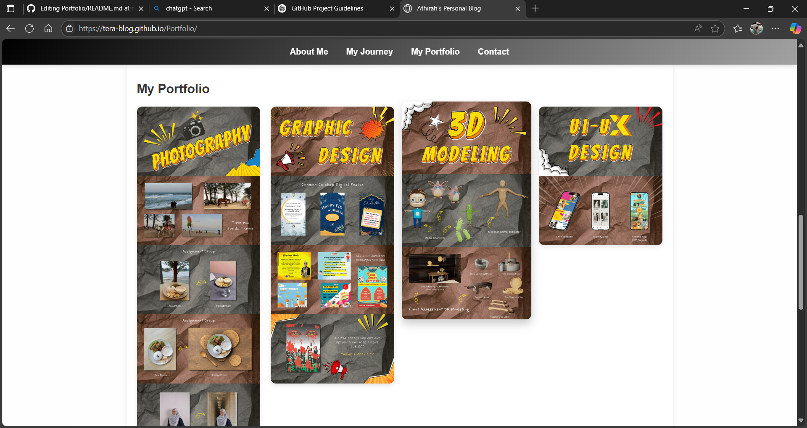

# Personal Blog Portfolio

## Description
A personal blog website to showcase my journey, portfolio, and interests in graphic design, multimedia, and Virtual Reality (VR) technology.

## 📑 Table of Contents
- [👤 About Me](#about-me)
- [🛤️ My Journey](#my-journey)
- [🎨 My Portfolio](#my-portfolio)
- [✉️ Contact](#contact)

## Features
- Responsive navigation menu
- Welcome section with smooth animations
- About Me section with profile picture
- Educational journey sharing
- Portfolio gallery with hover effects
- Contact information
- Scroll-based animation
- Aesthetic background pattern

## Technologies Used
- HTML
- CSS
- JavaScript

## How to Use
1. Website link: https://tera-blog.github.io/Portfolio/
2. Desktop: Click the navigation button to navigate eahh section

## Screenshot
### Home Page

### Portfolio Section

